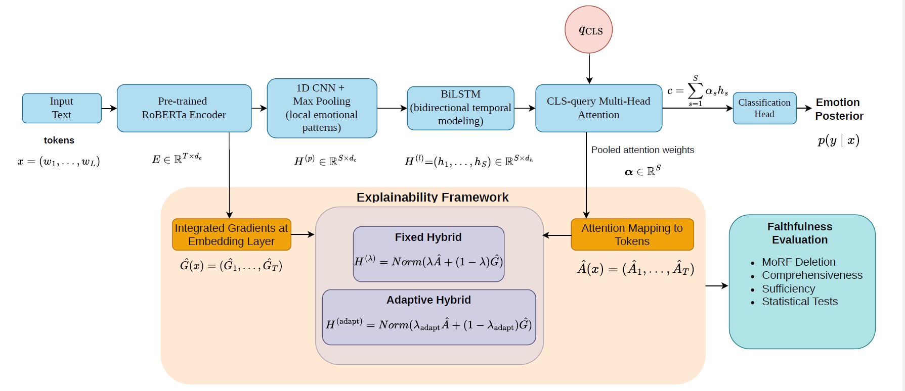

# xEmoRec: A Unified Architecture for Explainable Emotion Recognition toward Trustworthy Human-Machine Systems

xEmoRec is a reproducible Python implementation of an explainable emotion recognition framework for social media text. The project converts the original research notebooks into a modular machine-learning pipeline for training, evaluating, and interpreting a RoBERTa-CNN-BiLSTM-CLS-attention emotion classifier.

The framework is designed not only to achieve strong predictive performance, but also to evaluate whether model explanations are faithful to the model’s decision behavior. It integrates attention-based attribution, Integrated Gradients, fixed hybrid explanations, adaptive hybrid explanations, and perturbation-based faithfulness evaluation.

---

## Model Architecture

<p align="center">
  
</p>

The xEmoRec architecture consists of:

- **Pre-trained RoBERTa encoder** for contextual token representation
- **1D CNN with max pooling** for extracting local emotional patterns
- **BiLSTM layer** for bidirectional temporal sequence modeling
- **CLS-query multi-head attention** for attention-based decision aggregation
- **Classification head** for emotion prediction
- **Explainability framework** combining attention mapping, Integrated Gradients, fixed hybrid attribution, and adaptive hybrid attribution
- **Faithfulness evaluation** using MoRF deletion, comprehensiveness, sufficiency, and statistical significance testing

---

## Key Features

- Reproducible training pipeline for emotion classification
- Modular Python implementation under `src/`
- Command-line scripts for model training and XAI evaluation
- Latest adaptive-XAI workflow converted from notebook to Python
- Faithfulness-based explanation evaluation
- Publication-ready figures and statistical outputs
- Configurable experiment settings through command-line arguments
- Smoke-test mode for quick pipeline verification

---

## 1. Repository Structure

```text
emotion_xai_pipeline/
├── README.md
├── requirements.txt
├── pyproject.toml
├── .gitignore
├── assets/
│   └── xEmoRec_Architecture.png
├── configs/
│   └── README.md
├── notebooks/
│   ├── Model_Training.ipynb
│   └── Adaptive_XAI_modified_V2_Fig_Regenerated.ipynb
├── scripts/
│   ├── train_model.py
│   ├── run_adaptive_xai.py
│   └── run_pipeline.py
└── src/
    └── emotion_xai/
        ├── __init__.py
        ├── data.py
        ├── faithfulness.py
        ├── model.py
        ├── plotting.py
        ├── reproducibility.py
        ├── train.py
        └── xai.py
```

## 2. Setup

Use Python 3.10+ and install the package in editable mode:

```bash
python -m venv .venv
source .venv/bin/activate        # Windows: .venv\Scripts\activate
pip install -U pip
pip install -e .
```

Or install directly from `requirements.txt`:

```bash
pip install -r requirements.txt
```

## 3. Data format

The input CSV must contain at least these columns:

```text
text,label
```

Expected example:

```csv
text,label
"I am so happy today",1
"This makes me angry",3
```

The original notebook used `text.csv`. For GitHub, place the dataset under `data/text.csv` or pass the path explicitly.

## 4. Train the model

```bash
python scripts/train_model.py \
  --data-path data/text.csv \
  --out-dir runs_emotion_cls_2 \
  --epochs 50 \
  --batch-size 32 \
  --max-length 64 \
  --seed 42
```

Main outputs:

```text
runs_emotion_cls_2/
├── best_model_cls.pt
├── training_config.json
├── training_summary.json
├── history_cls.csv
├── classification_report_val.json
├── validation_predictions.csv
├── confusion_matrix_val_cls.png
├── loss_curve_cls.png
├── accuracy_curve_cls.png
├── macro_f1_curve_cls.png
└── example_explanations_cls_attention_ig_hybrid.csv
```

## 5. Run the latest adaptive-XAI analysis

Run this after training, using the checkpoint from the previous step:

```bash
python scripts/run_adaptive_xai.py \
  --data-path data/text.csv \
  --model-path runs_emotion_cls_2/best_model_cls.pt \
  --out-dir runs_emotion_cls_2/xai_faithfulness_v6_pubready_figures \
  --eval-pool-size 600 \
  --m-steps-screen 16 \
  --m-steps-deep 32
```

Main outputs:

```text
xai_faithfulness_v6_pubready_figures/
├── adaptive_xai_config.json
├── xai_eval_instances.csv
├── screening_metrics_all_candidates.csv
├── screening_summary_all_candidates.csv
├── final_metrics_shortlist.csv
├── summary_overall.csv
├── repeated_runs_aggregate.csv
├── repeated_runs_summary.csv
├── friedman_auc.csv
├── pairwise_wilcoxon_with_holm.csv
├── topk_sweep_summary.csv
├── classwise_auc.csv
├── classwise_auc_pivot.csv
├── subset_analysis.csv
├── top_tokens_per_instance.csv
├── report.txt
├── fig01_deletion_curves_morf_ci_pubready.png
├── fig02_deletion_auc_boxplot_pubready.png
├── fig03_comprehensiveness_boxplot_pubready.png
├── fig04_sufficiency_boxplot_pubready.png
├── fig05_attention_ig_spearman_histogram_pubready.png
├── fig06_adaptive_alpha_histogram_pubready.png
├── fig07_classwise_deletion_auc_heatmap_pubready.png
├── fig08_topk_comprehensiveness_sweep_pubready.png
└── fig09_topk_sufficiency_sweep_pubready.png
```

## 6. Run the full pipeline in one command

```bash
python scripts/run_pipeline.py \
  --data-path data/text.csv \
  --out-dir runs_emotion_cls_2 \
  --epochs 50 \
  --batch-size 32 \
  --eval-pool-size 600
```

## 7. Reproducibility notes

- The split is stratified and controlled by `--seed` / `--split-random-state`.
- Every run writes the resolved configuration to JSON inside the output directory.
- RoBERTa is frozen, as in the notebooks.
- The latest adaptive-XAI notebook is used as the source of truth for the XAI workflow.
- XAI can be computationally expensive. For a quick smoke test, reduce `--eval-pool-size`, `--m-steps-screen`, and `--m-steps-deep`.

Example smoke test:

```bash
python scripts/run_adaptive_xai.py \
  --data-path data/text.csv \
  --model-path runs_emotion_cls_2/best_model_cls.pt \
  --out-dir runs_emotion_cls_2/xai_smoke_test \
  --eval-pool-size 20 \
  --m-steps-screen 4 \
  --m-steps-deep 8
```

## 8. Suggested Git workflow

```bash
git init
git add README.md requirements.txt pyproject.toml .gitignore configs scripts src
git commit -m "Add reproducible emotion XAI pipeline"
```
